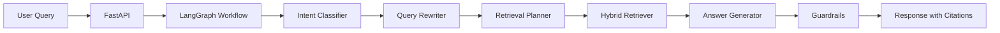
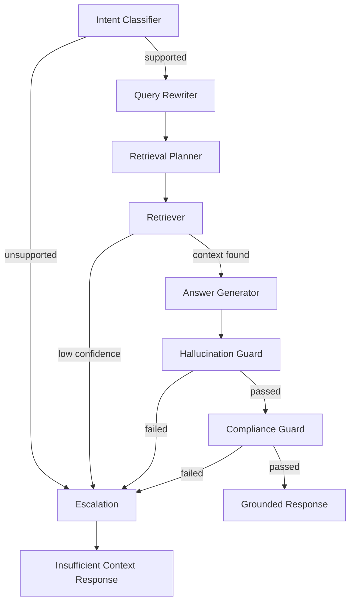

# Agentic RAG Intelligence Platform

A production-style LangGraph, LangChain, LangSmith, and RAG system for source-grounded enterprise knowledge intelligence using fully synthetic data.

## Public-Safe Demo Notice

This repository uses only synthetic documents from a fictional organization called Northstar Labs. It does not include workplace data, named-customer data, sensitive source material, privately owned system details, or real organization documents. See [docs/public_safety.md](docs/public_safety.md) for the full safety statement.

## Why This Project Exists

Modern LLM applications need more than a prompt and a vector database. Production-grade AI systems require retrieval orchestration, graph-based workflows, source grounding, evaluation, observability, guardrails, and failure handling.

This project demonstrates those patterns in a public-safe portfolio environment.

## What This Demonstrates

- Agentic RAG architecture
- LangGraph workflow orchestration
- LangChain retrieval pipelines
- LangSmith observability hooks
- Hybrid dense + sparse retrieval
- Source-grounded answer generation
- Citation-aware responses
- Hallucination mitigation
- Evaluation-driven LLMOps
- FastAPI-based AI service design
- Dockerized local development
- Cloud-ready architecture patterns

## Architecture



## LangGraph Workflow



## Tech Stack

Python 3.11+, FastAPI, LangChain, LangGraph, LangSmith, local Chroma-ready vector store abstraction, BM25 sparse retrieval, Pydantic v2, Docker, Docker Compose, Pytest, Ruff, and Black.

## Setup

```bash
git clone https://github.com/your-username/agentic-rag-intelligence-platform.git
cd agentic-rag-intelligence-platform
cp .env.example .env
docker-compose up --build
```

Local Python setup:

```bash
python -m venv .venv
source .venv/bin/activate
pip install -e ".[dev]"
python scripts/seed_synthetic_docs.py
python scripts/ingest_docs.py
uvicorn backend.app.main:app --reload
```

## Environment Variables

```bash
OPENAI_API_KEY=
LANGCHAIN_TRACING_V2=true
LANGCHAIN_API_KEY=
LANGCHAIN_PROJECT=agentic-rag-intelligence-platform
VECTOR_DB=chroma
```

LangSmith tracing is optional. If `LANGCHAIN_API_KEY` is present, the app configures LangSmith-compatible tracing variables and includes metadata for query, intent, retrieval strategy, retrieved document count, confidence score, and guardrail status. Without a key, the app still runs locally.

## API Examples

```bash
curl http://localhost:8000/health
```

```bash
curl -X POST http://localhost:8000/ingest \
  -H "Content-Type: application/json" \
  -d '{"reset_index": true}'
```

```bash
curl -X POST http://localhost:8000/chat \
  -H "Content-Type: application/json" \
  -d '{"query":"What does the AI governance policy say about human review?","filters":{"document_type":"policy"}}'
```

```bash
curl -X POST http://localhost:8000/evaluate \
  -H "Content-Type: application/json" \
  -d '{"limit": 5}'
```

## Sample Questions

- What does the AI governance policy say about human review?
- Summarize the QA automation strategy.
- What are the release readiness requirements?
- Compare the cloud deployment checklist and security review checklist.
- What happens if the assistant does not have enough context?

## Sample Response

```json
{
  "answer": "High-impact AI decisions require documented human review before release.",
  "citations": [
    {
      "source": "ai_governance_policy.md",
      "chunk_id": "ai-governance-policy-001",
      "document_type": "policy",
      "confidence": 0.91
    }
  ],
  "retrieval_strategy": "hybrid",
  "confidence_score": 0.88,
  "guardrail_status": "passed",
  "trace_id": "demo-trace-123",
  "trace_metadata": {
    "query": "What does the AI governance policy say about human review?",
    "intent": "policy_question",
    "retrieval_strategy": "hybrid",
    "retrieved_document_count": 1,
    "confidence_score": 0.88,
    "guardrail_status": "passed"
  }
}
```

## Evaluation

Run:

```bash
python scripts/run_eval.py
```

The evaluation layer writes `eval_results.json` and `eval_report.md`, then reports retrieval hit rate, citation coverage, groundedness, unsupported answer rate, and latency. The goal is not a perfect benchmark; it is a clear LLMOps loop for measuring retrieval and answer behavior against synthetic golden questions.

## Production Considerations

- Managed vector database
- API authentication
- Role-based access control
- Secrets management
- CI/CD
- Monitoring
- Evaluation datasets
- Prompt and version management
- Human feedback loop
- Data governance

## Cloud Deployment Pattern

A generic AWS or Azure pattern would run the FastAPI service as a container, use managed secrets, connect to a managed vector database, centralize logs, and publish observability signals for latency, retrieval quality, confidence score, and guardrail outcomes. A CI/CD pipeline would run tests, safety scan, evaluation, image build, and deployment promotion.

## Project Summary

I created this project to demonstrate a production-style Agentic RAG platform using fully synthetic data. The implementation separates the API boundary, LangGraph orchestration, hybrid retrieval, grounded response generation, guardrails, observability, and evaluation into clear system layers.

I built the workflow so each request moves through intent classification, retrieval planning, context assembly, answer generation, validation, and response construction. Unsupported or low-confidence requests return an insufficient-context response with trace metadata instead of unsupported citations.

## Roadmap

- Multi-tenant document spaces
- Role-based document access
- Advanced reranking
- Human feedback collection
- LangSmith dataset evaluation
- Redis semantic cache
- Streaming responses
- Next.js frontend
- Cloud deployment templates
