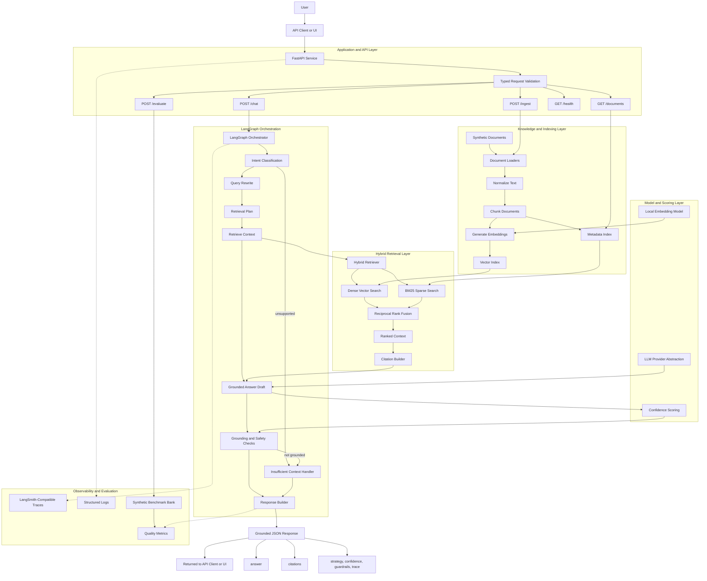
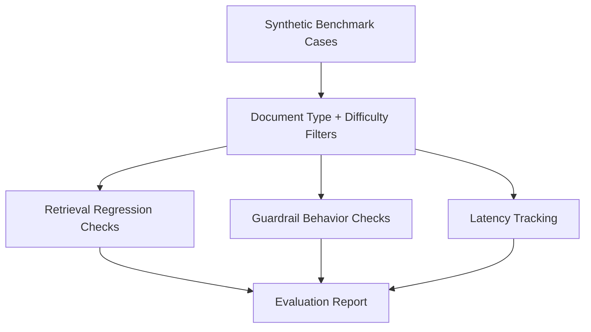

# Agentic RAG Intelligence Platform

[](https://github.com/shakehasan/agentic-rag-intelligence-platform/actions/workflows/ci.yml)


**Author:** Shake Hasan

A production-style LangGraph, LangChain, LangSmith, and RAG system for source-grounded knowledge intelligence using fully synthetic data.

I created this project as a public-safe AI engineering system. It demonstrates how a modern Agentic RAG platform can orchestrate retrieval, answer generation, guardrails, observability, evaluation, and feedback without relying on private organization data.

The default runtime is free and local. It uses deterministic local embeddings and an extractive grounded-answer fallback, so no external API key or hosted service is required to run the demo.


## Public-Safe Demo Notice

This repository uses only synthetic demo documents. It does not include workplace data, named-customer data, sensitive source material, privately owned system details, or real organization documents. See [docs/public_safety.md](docs/public_safety.md) for the full safety statement.

## Why This Project Exists

Modern LLM applications need more than a prompt and a vector database. Production-grade AI systems require retrieval orchestration, graph-based workflows, source grounding, evaluation, observability, guardrails, failure handling, feedback capture, and quality gates.

This project demonstrates those patterns in a public-safe demonstration environment.

## What This Demonstrates

- Agentic RAG architecture
- LangGraph workflow orchestration
- LangChain-compatible retrieval pipelines
- LangSmith observability hooks
- Hybrid dense + sparse retrieval
- Reciprocal rank fusion
- Source-grounded answer generation
- Citation-aware responses
- Hallucination mitigation
- Compliance and safety routing
- Synthetic evaluation datasets
- Feedback capture for reviewed traces
- Prompt registry and version notes
- Runtime metrics endpoint
- 560-case synthetic benchmark bank
- FastAPI-based AI service design
- Dockerized local development
- Cloud-ready architecture patterns
- CI quality gates

## Free Local Runtime

The repository is designed to run locally with free tooling:

- Local deterministic embeddings
- Local extractive grounded-answer fallback
- Local JSON vector index
- Local synthetic documents
- Local tests and evaluation scripts
- Optional tracing only when a tracing key is configured

No external model key is required for the default demo path.

## System Architecture



## Architecture Overview

FastAPI is the service boundary for the platform. It provides typed request validation, explicit route ownership, health checks, and a clean interface between external callers and the internal AI workflow.

LangGraph is used for orchestration because Agentic RAG benefits from explicit state transitions. The workflow separates intent classification, query rewriting, retrieval planning, context retrieval, answer generation, grounding validation, safety checks, and escalation.

Hybrid retrieval combines dense vector search with BM25 sparse retrieval. Dense search helps with semantic similarity, while sparse retrieval preserves exact-term recall for policy, checklist, and architecture questions. Reciprocal rank fusion merges both result sets into a single ranked context package.

Guardrails are separate components so answer grounding, citation validity, and insufficient-context behavior can be tested and improved independently. LangSmith hooks, structured logging, runtime metrics, feedback capture, and synthetic evaluation support a production-style operating model for an Agentic RAG system.

## Repository Structure

```text
backend/app/api          FastAPI route modules
backend/app/agents       LangGraph workflow and node implementations
backend/app/rag          ingestion, chunking, retrieval, citations, diagnostics
backend/app/services     LLM, LangSmith, metrics, feedback, prompt registry
backend/app/schemas      Pydantic request and response contracts
backend/app/solutions    public-safe synthetic solution blueprints
backend/app/evals        golden dataset and evaluation metrics
data/synthetic_docs      synthetic demo knowledge corpus
docs                     architecture, RAG design, deployment, playbooks
scripts                  ingestion, evaluation, safety scan, data seeding
.github/workflows        CI quality gates
```

## API Surface

| Endpoint | Purpose |
| --- | --- |
| `GET /health` | Service health check |
| `POST /ingest` | Ingest synthetic documents and build the local index |
| `POST /chat` | Run the Agentic RAG workflow and return a grounded answer |
| `POST /evaluate` | Run synthetic evaluation from golden questions |
| `GET /documents` | List indexed document summaries |
| `POST /feedback` | Capture trace-level reviewer feedback |
| `GET /metrics` | Return lightweight runtime metrics |
| `GET /prompts` | Show active prompt registry entries |
| `GET /solutions` | List public-safe synthetic solution blueprints |
| `GET /benchmarks` | List synthetic benchmark cases for retrieval and guardrail testing |

## Tech Stack

Python 3.11+, FastAPI, Pydantic v2, LangChain, LangGraph, LangSmith, BM25 sparse retrieval, local vector store abstraction, Docker, Docker Compose, Pytest, Ruff, and Black.

## Setup

```bash
git clone https://github.com/shakehasan/agentic-rag-intelligence-platform.git
cd agentic-rag-intelligence-platform
cp .env.example .env
docker-compose up --build
```

Local Python setup:

```bash
python -m venv .venv
source .venv/bin/activate
pip install -e ".[dev]"
python scripts/seed_synthetic_docs.py
python scripts/ingest_docs.py
uvicorn backend.app.main:app --reload
```

On Windows PowerShell:

```powershell
python -m venv .venv
.\.venv\Scripts\Activate.ps1
pip install -e ".[dev]"
python scripts\seed_synthetic_docs.py
python scripts\ingest_docs.py
uvicorn backend.app.main:app --reload
```

## Environment Variables

```bash
LLM_API_KEY=
LLM_BASE_URL=
LLM_MODEL=local-grounded-fallback
API_KEY=
LANGCHAIN_TRACING_V2=true
LANGCHAIN_API_KEY=
LANGCHAIN_PROJECT=agentic-rag-intelligence-platform
VECTOR_DB=chroma
VECTOR_INDEX_DIR=data/index
SYNTHETIC_DOCS_DIR=data/synthetic_docs
CHUNK_SIZE=900
CHUNK_OVERLAP=140
RETRIEVAL_TOP_K=6
MIN_CONFIDENCE=0.35
```

Tracing is optional. If `LANGCHAIN_API_KEY` is present, the app configures LangSmith-compatible tracing variables and includes metadata for query, intent, retrieval strategy, retrieved document count, confidence score, and guardrail status. Without a key, the app still runs locally using the free deterministic fallback path.

## API Examples

```bash
curl http://localhost:8000/health
```

```bash
curl -X POST http://localhost:8000/ingest \
  -H "Content-Type: application/json" \
  -d '{"reset_index": true}'
```

```bash
curl -X POST http://localhost:8000/chat \
  -H "Content-Type: application/json" \
  -d '{"query":"What does the AI governance policy say about human review?","filters":{"document_type":"policy"}}'
```

```bash
curl -X POST http://localhost:8000/feedback \
  -H "Content-Type: application/json" \
  -d '{"trace_id":"demo-trace-123","query":"What does the AI governance policy say about human review?","signal":"helpful"}'
```

```bash
curl http://localhost:8000/metrics
curl http://localhost:8000/prompts
curl http://localhost:8000/solutions
curl "http://localhost:8000/benchmarks?limit=10&document_type=policy"
```

```bash
curl -X POST http://localhost:8000/evaluate \
  -H "Content-Type: application/json" \
  -d '{"limit": 5}'
```

## Sample Questions

- What does the AI governance policy say about human review?
- Summarize the QA automation strategy.
- What are the release readiness requirements?
- Compare the cloud deployment checklist and security review checklist.
- How should product teams handle privacy reviews?
- What happens if the assistant does not have enough context?

## Sample Response

```json
{
  "answer": "High-impact AI decisions require documented human review before release.",
  "citations": [
    {
      "source": "ai_governance_policy.md",
      "chunk_id": "ai-governance-policy-001",
      "document_type": "policy",
      "confidence": 0.91
    }
  ],
  "retrieval_strategy": "hybrid",
  "confidence_score": 0.88,
  "guardrail_status": "passed",
  "trace_id": "demo-trace-123",
  "trace_metadata": {
    "query": "What does the AI governance policy say about human review?",
    "intent": "policy_question",
    "retrieval_strategy": "hybrid",
    "retrieved_document_count": 1,
    "confidence_score": 0.88,
    "guardrail_status": "passed"
  }
}
```

## Solution Blueprints

The `/solutions` endpoint presents public-safe synthetic blueprints that show how the platform pattern can be reused across knowledge intelligence workflows:

- AI Governance Policy Intelligence
- Release Readiness Copilot
- Cloud Deployment Advisor
- QA Strategy Intelligence
- Privacy Review Assistant
- Incident Review Assistant
- Support Triage Assistant
- Architecture Explainer
- Security Review Assistant
- Vendor Evaluation Assistant

Each blueprint includes a problem statement, architecture pattern, capabilities, evaluation focus, and public-safe note.

## Benchmark Bank

The `/benchmarks` endpoint exposes a 560-case synthetic benchmark bank for retrieval, guardrail, and response behavior testing. The cases are generic, public-safe, and free to run locally.



Example:

```bash
curl "http://localhost:8000/benchmarks?limit=25&difficulty=advanced"
```

## Evaluation

Run:

```bash
python scripts/run_eval.py
```

The evaluation layer writes `eval_results.json` and `eval_report.md`, then reports retrieval hit rate, citation coverage, groundedness, unsupported answer rate, and latency. The goal is a clear LLMOps loop for measuring retrieval and answer behavior against synthetic golden questions.

## Quality Gates

```bash
python scripts/public_safety_scan.py
ruff check .
pytest
python scripts/run_eval.py
```

The GitHub Actions workflow runs public safety scanning, linting, and tests on pushes and pull requests.

## Production Considerations

- Managed vector database
- API authentication
- Role-based access control
- Managed secrets
- CI/CD quality gates
- Centralized monitoring
- Evaluation datasets
- Prompt and version management
- Human feedback loop
- Data governance

## Cloud Deployment Pattern

A generic cloud pattern would run the FastAPI service as a container, use managed secrets, connect to a managed vector database, centralize logs, and publish observability signals for latency, retrieval quality, confidence score, and guardrail outcomes. A CI/CD pipeline would run tests, safety scan, evaluation, image build, and deployment promotion.

## Project Summary

I created this project to demonstrate a production-style Agentic RAG platform using fully synthetic data. The implementation separates the API boundary, LangGraph orchestration, hybrid retrieval, grounded response generation, guardrails, observability, evaluation, feedback capture, and prompt management into clear system layers.

I built the workflow so each request moves through intent classification, retrieval planning, context assembly, answer generation, validation, and response construction. Unsupported or low-confidence requests return an insufficient-context response with trace metadata instead of unsupported citations.

## Author

Shake Hasan

## License

MIT License. See [LICENSE](LICENSE).
