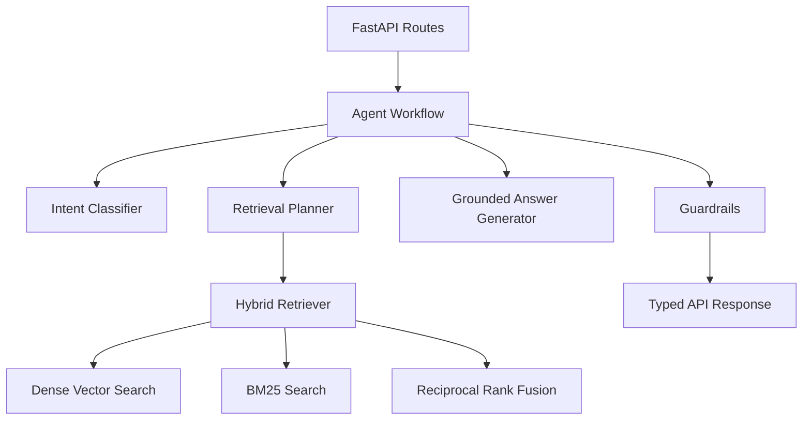

# Architecture

The Agentic RAG Intelligence Platform is organized as a modular FastAPI backend with separate layers for API routes, schemas, retrieval, graph workflow nodes, service integrations, and evaluation.

The local runtime uses deterministic embeddings and a persistent JSON vector index so reviewers can run the project without external services. The retrieval interface is designed so a managed vector database can replace the local index without changing API behavior.

