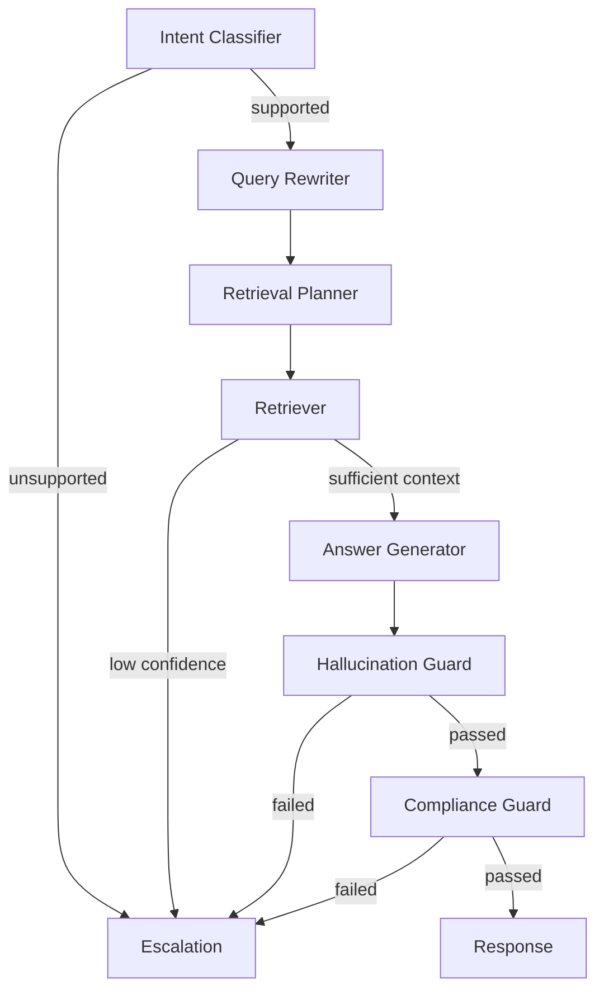

# LangGraph Workflow

The workflow is implemented as small, testable nodes and can be compiled into a LangGraph state graph when the dependency is available.

The state carries query, intent, filters, retrieval strategy, retrieved context, answer, citations, confidence score, guardrail status, and trace metadata.

Unsupported questions, low-confidence retrieval, failed grounding checks, or invalid citations route to escalation. Escalation returns the standard insufficient-context response instead of inventing an answer.

